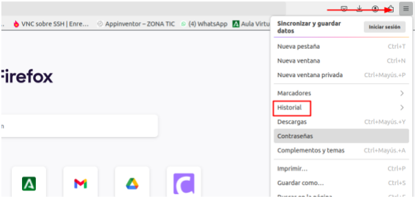
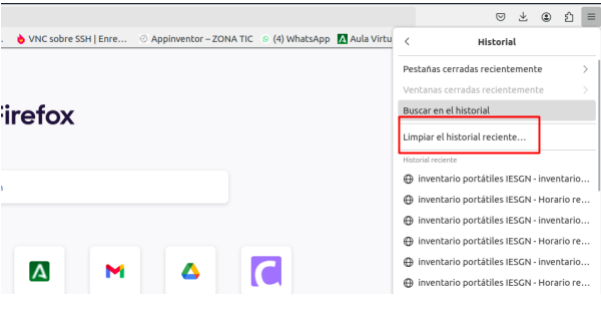
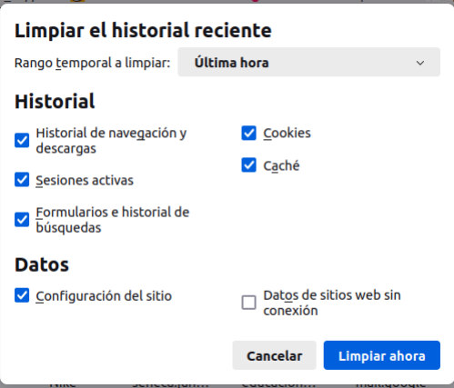
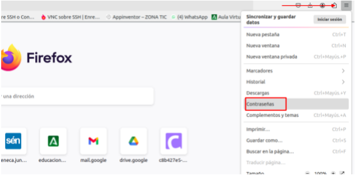
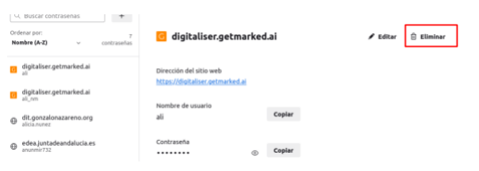
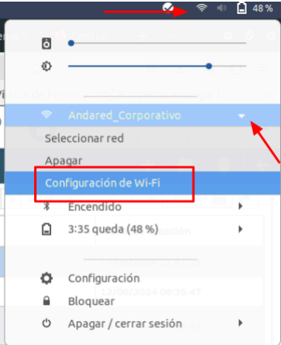
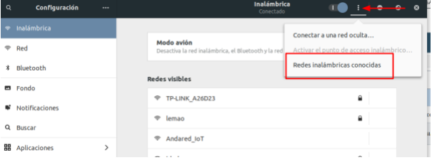

# Procedimientos y Servicios TIC

## Reserva de Equipos 

### Carros de Portátiles

El centro dispone de **2 carros de portátiles**, ubicados en:

- **Aula C12**
- **Sala de profesores**

#### Procedimiento de reserva

- La reserva de los carritos se realiza a través de la plataforma [**GESTIONA**](https://gestiona.gonzalonazareno.org/reservas/reserva).
- La reserva puede hacerse:
  - Para un **día y hora concretos**, o bien
  - Como **reserva recurrente** para un periodo determinado (por ejemplo, durante todo un trimestre los martes a segunda hora).
- Para acceder a las llaves, se debe consultar con el personal de conserjería.
- Está permitido **solicitar ayuda al alumnado para el traslado** de los carritos, pero en ningún caso el alumnado puede acceder directamente a por el material.

#### Normas de uso

- **Los carros deben permanecer cerrados y organizados** cuando no estén en uso.
- El traslado del carro se realizará **con cuidado**, evitando golpes o desplazamientos bruscos.
- Se debe **revisar el contenido al inicio y al finalizar la clase**, utilizando el **formulario de control establecido**.
- Los portátiles deben ser **apagados y conectados a carga** al finalizar su uso, siempre que el aula lo permita.
- Es super importante que al finalizar la clase cada portátil ocupe su **lugar**.
- Cualquier **incidencia o mal funcionamiento** debe registrarse como [**Incidencia TIC en GESTIONA**](https://gestiona.gonzalonazareno.org/tde/misincidenciastic).

#### Buenas prácticas

- Asegurar el uso exclusivo del material con fines educativos.
- Evitar el almacenamiento de datos personales o configuraciones individuales en los dispositivos.
- Mantener el orden en el interior del carro, respetando los espacios asignados a cada equipo.
- Verificar que los dispositivos están correctamente colocados y cargando al finalizar su uso.

### Mochila de Portátiles

El centro cuenta con un total de **25 portátiles** disponibles como recurso TIC para su uso en el aula. Estos dispositivos están organizados en **5 maletas**, cada una con **5 portátiles**, y su préstamo y uso se rige por el siguiente procedimiento.

#### Procedimiento de reserva

- La reserva de las maletas se realiza a través de la plataforma [**GESTIONA**](https://gestiona.gonzalonazareno.org/reservas/reserva).
- El profesorado puede reservar **hasta 5 maletas** (una por grupo o actividad, según necesidades).
- La reserva puede hacerse:
  - Para un **día y hora concretos**, o bien
  - Como **reserva recurrente** para un periodo determinado (por ejemplo, durante todo un trimestre los martes a segunda hora).
- **Independientemente de la reserva en GESTIONA**, es obligatorio dejar constancia del préstamo en el **cuaderno físico** que se encuentra con las **conserjes**.
- Las maletas están ubicadas en **"Administración"**. Para acceder a ellas, se debe consultar con el personal de conserjería.
- Está permitido **solicitar ayuda al alumnado para el traslado** de las maletas, pero en ningún caso el alumnado puede acceder directamente a la zona de **Administración**.

#### Normas de uso

- Cada mochila está identificada con una figura y color concreto. **Cada dispositivo debe ir en su mochila**.
- Cada maleta incluye una **alargadera de corriente** para conectar los cargadores durante el uso. No se garantiza que los portátiles estén completamente cargados.
- Si es necesario, se pueden usar **alargaderas extensibles** (de color verde) disponibles en el centro.
- **Al inicio y al final de cada clase**, se debe hacer un **recuento del material**.
- Cualquier **incidencia o fallo** detectado en los dispositivos debe registrarse como [**Incidencia TIC en GESTIONA**](https://gestiona.gonzalonazareno.org/tde/misincidenciastic), a través del formulario específico.

#### Buenas prácticas

- Hacer un uso **responsable** del recurso.
- **No permitir que el alumnado** guarde información personal en los portátiles (documentos, contraseñas, configuraciones, etc.).
- Evitar la **personalización del sistema** (fondos de escritorio, accesos directos, cambios en la configuración).
- Comprobar que todos los portátiles se devuelven correctamente al finalizar la clase.

### Táblets

El centro dispone de **2 mochilas** con **10 tablets cada una**, disponibles para su uso por parte del profesorado como recurso TIC en el aula.

#### Procedimiento de reserva

- La reserva de las maletas se realiza a través de la plataforma [**GESTIONA**](https://gestiona.gonzalonazareno.org/reservas/reserva).
- El profesorado puede reservar **hasta 2 maletas** (una por grupo o actividad, según necesidades).
- La reserva puede hacerse:
  - Para un **día y hora concretos**, o bien
  - Como **reserva recurrente** para un periodo determinado (por ejemplo, durante todo un trimestre los martes a segunda hora).
- **Independientemente de la reserva en GESTIONA**, es obligatorio dejar constancia del préstamo en el **cuaderno físico** que se encuentra con las **conserjes**.
- Las maletas están ubicadas en **"Administración"**. Para acceder a ellas, se debe consultar con el personal de conserjería.
- Está permitido **solicitar ayuda al alumnado para el traslado** de las maletas, pero en ningún caso el alumnado puede acceder directamente a la zona de **Administración**.

#### Normas de uso

- **Al inicio y final de la clase**, se debe realizar un **recuento de tablets** utilizando el **formulario de control establecido**.
- Las tablets deben ser **apagadas y almacenadas correctamente** en la mochila al finalizar su uso.
- Si se detecta cualquier **incidencia o problema técnico**, debe registrarse como [**Incidencia TIC en GESTIONA**](https://gestiona.gonzalonazareno.org/tde/misincidenciastic), utilizando el formulario correspondiente.

#### Buenas prácticas

- Usar las tablets exclusivamente con fines educativos.
- **No permitir que el alumnado** guarde archivos personales, imágenes o aplicaciones fuera de las previamente instaladas.
- No modificar configuraciones, fondos de pantalla ni instalar aplicaciones sin autorización.

### Solicitud de Préstamo de Portátiles para Profesorado

El centro pone a disposición del profesorado una serie de portátiles que pueden ser utilizados como herramienta de trabajo docente durante el curso escolar.

#### Petición

- Para solicitar un portátil al inicio del curso, es necesario **rellenar el siguiente formulario**:

  👉 [Formulario de solicitud de préstamo de portátiles](https://docs.google.com/forms/d/e/1FAIpQLSfInFUU8SDnYKKmHuUs2PBk79PB1GRtxMlu-husQY9bmC3O2Q/viewform?usp=sf_link)

- Si la solicitud se realiza una vez comenzado el curso, además de rellenar el formulario, será obligatorio **notificar la petición al Coordinador/a TDE a través de Séneca**, indicando que se ha solicitado un préstamo.

#### Periodo de préstamo

- El periodo de préstamo abarca desde el **mes de septiembre hasta el mes de junio**.
- **Todos los portátiles deberán ser devueltos antes de la finalización del curso académico**.

#### Normas de uso

- El portátil es un **recurso del centro** cedido para uso profesional y docente.
- Se debe **mantener el equipo en buen estado** y notificar cualquier incidencia técnica a través del procedimiento habitual de incidencias TIC en [**Incidencia TIC en GESTIONA**](https://gestiona.gonzalonazareno.org/tde/misincidenciastic).
- El profesorado es responsable de la **custodia y correcto uso del equipo** durante todo el periodo de préstamo.
- El equipo debe mantener el **Sistema operativo original**.
- **Antes de devolver el equipo** se debe realizar lo siguiente:

  1. **Borrar todo el contenido almacenado en el portátil** en las distintas ubicaciones: Escritorio, Descargas, Documentos, Imágenes, Música, Vídeos y Papelera.

  2. **Borrar el historial de Firefox**:
     
     - Accede al menú y selecciona la opción **"Historial"**.  
       

     - Selecciona la opción **"Limpiar el historial reciente"**.  
       

     - Marca todas las opciones como se muestra en la imagen y pulsa en **"Limpiar ahora"**.  
       

  3. **Borrar contraseñas almacenadas en Firefox**:

     - Accede al menú y selecciona la opción **"Contraseñas"**.  
       

     - Elimina todas las contraseñas guardadas.  
       

  4. **Borrar contraseñas Wi-Fi del usuario Séneca**:

     - Selecciona el icono de Wi-Fi, pulsa sobre la red **"Andared_Corporativo"** y accede a **"Configuración de Wi-Fi"**.  
       

     - Pulsa sobre el menú de los tres puntos y accede a **"Redes inalámbricas conocidas"**.  
       

     - Una vez dentro, selecciona las redes que desees olvidar para eliminar todos los datos.  
       

### Solicitud de Préstamo de Portátiles para Alumnado

### Gestión de Incidencias Técnicas

### Solución de Fallos Técnicos Habituales

### Conexión a la Red Andared Corporativa
